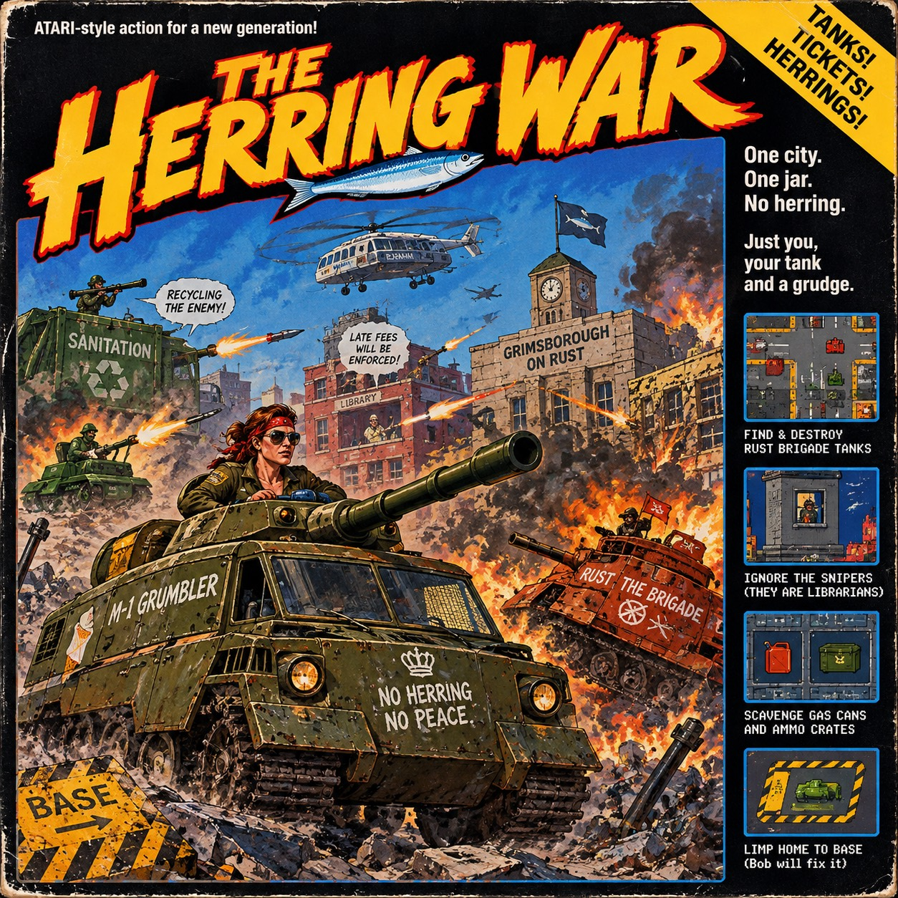

<p align="center">
  
</p>

# Tanks of Doom

A top-down tank shooter for macOS, written in Swift with SpriteKit. Every level is a freshly generated, war-torn city. You have one tank, very little fuel, and no friends.

## The Story So Far

In the year 2087 the city of **Grimsborough-on-Rust** declared independence from the rest of the planet. The reason was a dispute over the last remaining jar of pickled herring. Negotiations collapsed within eleven minutes. The herring was never found.

What followed was **The Great Tantrum**: a war fought entirely by the city's municipal departments. The Parks Department weaponized its lawnmowers. The Library imposed late fees *with artillery*. Sanitation went rogue and took to the rooftops with bazookas, muttering about "recycling the enemy." Nobody remembers who started it. Everybody remembers who finished the herring. It was Gerald. Gerald is gone now.

Amid the rubble roams the **Rust Brigade**, a fleet of reddish tanks crewed by former traffic wardens. They have sworn to ticket every living thing until the herring is returned. They patrol the streets in loops, sighing heavily. Their reaction times improve every level, because nothing sharpens a traffic warden like resentment.

You are **Sergeant Dolores "Dolly" Vankamp**, the last licensed driver of the **M-1 Grumbler**, an olive-green tank built from an armoured ice-cream van and a grudge. Your mission:

1. Find and destroy every Rust Brigade tank in the city.
2. Ignore the snipers in the windows. They are mostly librarians, and they *will* shush you with rockets.
3. Scavenge **gas cans** and **ammo crates** hidden in alleys, craters and ruins. Someone hid them there out of spite.
4. Limp home to **BASE**, the yellow-striped concrete square in the bottom-left corner, where a mechanic named Bob will hit your tank with a wrench until it is less broken.

Clear a city and Command will airlift you to the next one. The next one is always worse. Command doesn't explain why. Command has never explained anything.

*The herring is out there. Somewhere.*

## Download and Play

Ready-built versions are on the [Releases page](https://github.com/dpalmqvist/tanks-of-doom/releases/latest). They run on macOS 14 (Sonoma) or newer, on both Apple Silicon and Intel Macs.

1. Download `TanksOfDoom-<version>-macOS.zip` and double-click it to unzip.
2. Drag **Tanks of Doom** into your Applications folder.
3. **The first time only:** the app isn't signed by an identified developer, so macOS blocks it. Open **System Settings → Privacy & Security**, scroll down, and click **Open Anyway**. You can also run this in Terminal:

   ```bash
   xattr -dr com.apple.quarantine "/Applications/Tanks of Doom.app"
   ```

## Building from Source

### Requirements

- macOS 14 (Sonoma) or newer
- Xcode 16 or newer (or a Swift 6 toolchain), for `swift build`

There are no third-party dependencies and no asset files. All art and sound are generated in code when the game starts.

### Build and Run

```bash
git clone https://github.com/dpalmqvist/tanks-of-doom.git
cd tanks-of-doom
swift run TanksOfDoom
```

`swift run` builds the game the first time, then opens the window on the title screen. Press **Enter** to start.

Other useful commands:

```bash
swift build                  # build only (debug)
swift build -c release       # optimized build
.build/release/TanksOfDoom   # run the optimized build
swift test                   # run the unit tests for the game logic
swift run TanksRelay         # run the multiplayer relay server locally
```

## Controls

| Action | Keys |
| --- | --- |
| Drive forward / back | **W** / **S** (or ↑ / ↓) |
| Turn the hull | **A** / **D** (or ← / →) |
| Fire main gun | **Space** |
| Fire machine gun | **F** |
| Turn turret by hand | **Q** / **E** |
| Next target | **Tab** |
| Pause | **Esc** |
| Toggle minimap size | **M** |
| Abandon tank (only when out of fuel) | **R** |
| Quit | **Cmd-Q** |

**Aiming:** by default the turret aims itself at the nearest threat it can see. Enemy tanks come first, then soldiers in windows. Red brackets mark the target, and a red ring marks it on the minimap. Press **Tab** to switch targets. **Q/E** take over by hand, and auto-aim resumes 3 seconds after you let go.

## Multiplayer

Two players on two Macs fight it out in the same city, with the Rust Brigade still roaming and the
snipers still in their windows. Each player starts with the same number of lives. Every death costs
one, whether your opponent got you or a librarian with a bazooka did. You respawn somewhere random
after three seconds, blinking and untouchable until you fire or three more seconds pass. Take all of
your opponent's lives to win.

1. Press **2** on the title screen.
2. One player presses **H** to host and reads out the five-letter room code. The host picks the
   number of lives (←/→) and how much AI joins in (↑/↓).
3. The other player presses **J**, types the code and presses **Enter**, then **Enter** again when
   ready.
4. The host presses **Enter** to start.

Each player has their own base (olive bottom-left for the host, blue top-right for the guest) and can
only repair there. In a match, **Esc** offers to leave instead of pausing. After the match, both
pressing **R** starts a rematch in a new city.

Matches go through a small relay server (see [docs/relay.md](docs/relay.md)). To play against
yourself locally:

```bash
swift run TanksRelay                                          # terminal 1
TANKS_RELAY_URL=ws://localhost:8080/ws swift run TanksOfDoom   # terminals 2 and 3
```

## How to Survive

- **Your tank:** 100 armor, 100 fuel, 20 shells, 300 machine-gun rounds. Driving burns fuel; idling burns it slowly. At zero fuel you can't move, but you can still aim and shoot.
- **Main gun:** splash damage. It hurts tanks, soldiers and buildings. Hit a building enough and it cracks, crumbles, and collapses into rubble, taking everyone inside with it.
- **Machine gun:** only good against soldiers. Tanks and buildings ignore it.
- **Soldiers** hide inside buildings and pop up at the windows to shoot. You can only hit them while they're exposed.
  - Riflemen and machine gunners chip away at you.
  - Bazooka rockets are slow enough to dodge.
  - Mortars (from level 2 onward) lob shells over buildings. A pulsing red circle shows where each one will land.
- **Enemy tanks** patrol until they spot you, chase your last known position, and retreat when badly damaged. Line of sight matters for both sides: buildings block shots and vision, rubble doesn't.
- **Rubble and craters** halve your speed.
- **Caches:** gas cans give +45 fuel, ammo crates +8 shells and +120 rounds. They aren't shown on the minimap, so go looking.
- **Base** repairs armor first, then fills the fuel tank, both over time. Ammo is topped up to a minimum of 8 shells and 150 rounds; full loads come from caches.
- **Stranded?** If you run dry far from home, press **R** to abandon the tank and end the run.

Every level adds more enemy tanks with thicker armor, faster driving and quicker trigger fingers, and more buildings full of soldiers. Your best run (levels cleared, then kills) is saved.

## For Developers

- **Skip the title screen:** `TANKS_START_LEVEL=3 swift run TanksOfDoom` starts straight at level 3. In this mode the window opens behind your other windows without taking focus, so click on it before playing.
- **Project layout:**
  - `Sources/TanksCore/` holds the pure game logic, with no SpriteKit: seeded city generator, A* pathfinding, line of sight, weapon and damage rules, tank stats, enemy AI and target selection. It's covered by the tests in `Tests/TanksCoreTests/`.
  - `Sources/TanksOfDoom/` is the macOS app: window, SpriteKit scenes, tanks, soldiers, projectiles, HUD, minimap, procedural textures and synthesized sound.
- **Design docs:** the design spec and implementation plan live in `docs/superpowers/`.
- **Publishing a release:** push a version tag (`git tag v1.0.0 && git push origin v1.0.0`). The `Release` GitHub Actions workflow runs the tests, builds a universal `Tanks of Doom.app` with `scripts/package-app.sh`, and attaches the zip to a new GitHub release. Run `scripts/package-app.sh 1.0.0` to build the same zip locally in `dist/`.
